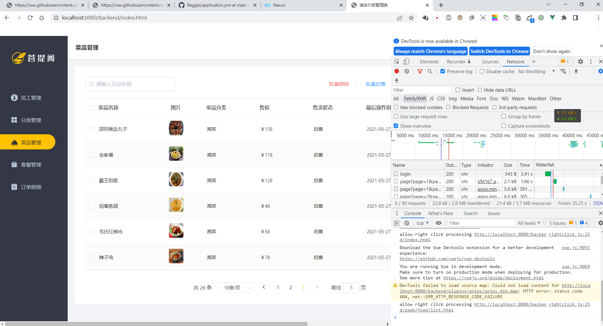
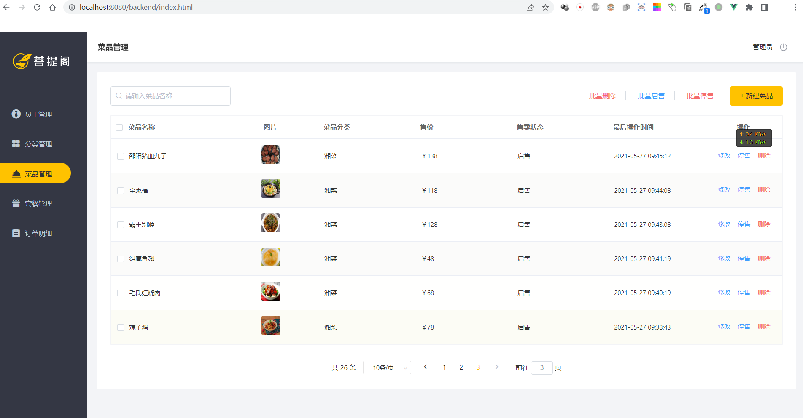
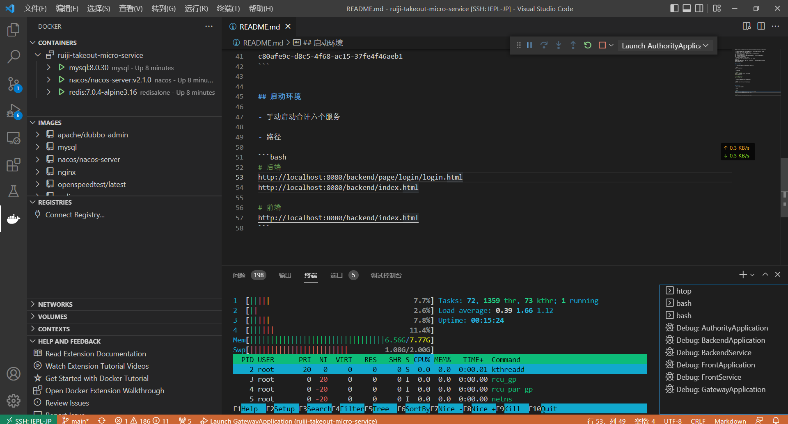
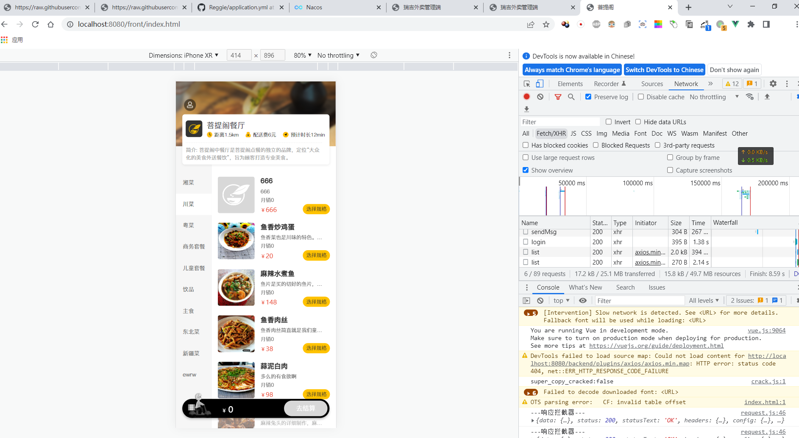

视频链接 https://www.bilibili.com/video/BV1S94y1m7uz?share_source=copy_web：


## 启动前置环境

- 1. 使用docker-compose启动nacos,mysql,redis环境.

```bash
docker-compose up -d
```

- 2. 导入数据表

```bash
# 导入nacos数据表.
mysql -h 127.0.0.1 -uroot -pabc123456
source nacos.sql

# 导入reggie数据表
source reggie.sql
```

- 3. 创建dev,注意id与parent中pom的dev匹配.

```bash
c80afe9c-d8c5-4f68-ac15-37fe4f46aeb1
```

## 启动环境

<font color=red>升级MySQL的 mysql-connector-java版本以使用8.0.30</font>

占用端口为:8080-8085.

```xml
mysql-connector-java
<!-- 更换版本6.0.6到8.0.30 -->
<!-- <mysql.version>6.0.6</mysql.version> -->
mysql-connector-java
<mysql.version>8.0.30</mysql.version>
```

- 手动启动合计六个服务

- 路径

```bash
# 后端登陆页面
http://localhost:8080/backend/page/login/login.html

http://localhost:8080/backend/index.html

# 前端登陆页面
http://localhost:8080/front/page/login.html

# 前端
http://localhost:8080/backend/index.html

# nacos地址
http://127.0.0.1:8848/nacos/
```

## 运行展示







